# USAPL Raw Nationals Analysis
Yulia Zamriy  
September 2, 2017  


## Overview

This report contains an analysis of three Raw National competitions (2014-2016). In particular, it is focused on examining attempt selection patterns across all lifters.
**Main objective:** can I extract any insights from the data to help me with attempt selection in the next Raw National competition?

#### Read in the processed data from the csv file


```r
setwd("C:/Users/yzamriy/Documents/Tools and Methodology/DS/Powerlifting/Clean code")
library(ggplot2)
library(tidyverse)
```

```r
Raw2014_2016 <- read_csv("Raw2014_2016_processed.csv")
```

#### First Attempt

*Subset:* Lifters that:

- Successfully performed 1st and 2nd attempts (if a lifter fails first or second attempts, their strategy for the third can be very different and non-applicable for this analysis)

- Received official *Total*, hence have non-zero Wilks for the meet

##### **Squat**

How big is first attempt compared to the third? 


```r
with(subset(Raw2014_2016,Squat_attempts %in% c('111','110') & Raw2014_2016$Total > 0),
summary(Squat1_pct_of_3rd))
```

```
##    Min. 1st Qu.  Median    Mean 3rd Qu.    Max. 
##  0.0000  0.8791  0.9011  0.8890  0.9184  0.9714
```

What is the success rate of the third attempt after succeeding at 1st and 2nd?
Among women:

```r
with(subset(Raw2014_2016,Squat_attempts %in% c('111','110') & 
                Raw2014_2016$Total > 0 &
                Raw2014_2016$Sex == 'f'),
summary(Squat3_success))
```

```
##    Min. 1st Qu.  Median    Mean 3rd Qu.    Max. 
##  0.0000  0.0000  1.0000  0.6271  1.0000  1.0000
```
Among men:

```r
with(subset(Raw2014_2016,Squat_attempts %in% c('111','110') & 
                Raw2014_2016$Total > 0 &
                Raw2014_2016$Sex == 'm'),
summary(Squat3_success))
```

```
##    Min. 1st Qu.  Median    Mean 3rd Qu.    Max. 
##  0.0000  0.0000  1.0000  0.6279  1.0000  1.0000
```


```r
g <- ggplot(Raw2014_2016[Raw2014_2016$Squat_attempts %in% c('111','110') & Raw2014_2016$Total > 0,], 
            aes(Points, Squat1_pct_of_3rd, colour = Sex_factor))
g + geom_point()+
    facet_grid(Squat_attempts_factor~Sex_factor) +
    labs(color = "Sex") +
    geom_smooth(method = "lm", show.legend = TRUE, aes(colour = "Linear Smooth Line"), se = FALSE) +
    ggtitle("Relative diffference between FIRST and last SQUAT attempts") +
    xlab("Wilks Points") +
    ylab("Squat: 1st attempt as % of 3rd") +
    scale_y_continuous(limits = c(0.6,1))
```

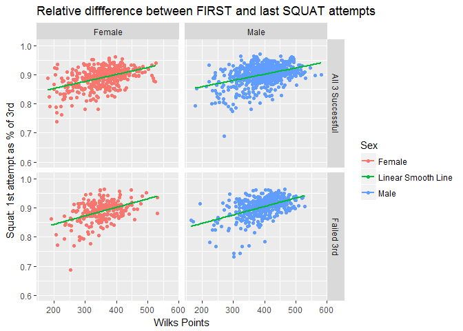<!-- -->

**Insights** 

- The stronger the lifter, the higher the first attempt is  as compared to the third attempt (failed or successful). This applies to lifters of both sexes.

- This pattern might be because: Lifters with lower Wilks are not comfortable with higher openers and need to build confidence. They probably choose their first attempts based on the common rule of thumb: open with the weight that they can rep 3 times in one set. Stronger lifters, on the other hand, most likely have more experience and are more confident about their performance.

**For future analysis:** Lifter experience can be captured by the number of meets prior to Nationals. This data is available and will be analyzed later.

Is there a difference in how men and women pick their first attempts?


```r
g <- ggplot(Raw2014_2016[Raw2014_2016$Squat_attempts %in% c('111','110') & Raw2014_2016$Total > 0,], 
            aes(Points, Squat1_pct_of_3rd, colour = Sex_factor))
g + geom_smooth(method = "lm") +
    facet_grid(Squat_attempts_factor~.) +
    labs(color = "Sex") +
    ggtitle("Relative diffference between FIRST and last SQUAT attempts") +
    xlab("Wilks Points") +
    ylab("Squat: 1st attempt as % of 3rd") +
    geom_hline(yintercept = 0.92, colour = "darkslategray", size = 1, linetype = 2)+
    geom_hline(yintercept = 0.89, colour = "blue", size = 1, linetype = 2) +
    annotate("text", x = 200, y = 0.935, label = "92% of the 3rd", colour = "darkslategray" ) +
    annotate("text", x = 200, y = 0.905, label = "89% of the 3rd", colour = "blue")
```

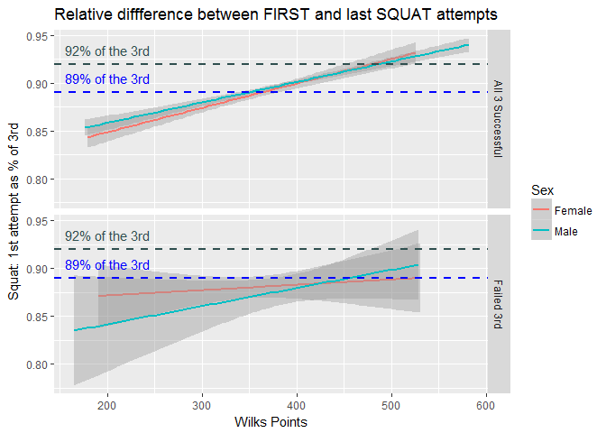<!-- -->

**Insights** 

- There is little difference between lifters of both sexes across all strength levels who successfully complete all three attempts in how they pick their first attempt relative to the third. 

- There is no consistent difference among the lifters who fail their third.

- **Takeaway:** consider the opener in 89-92% range of the projected third attempt (based on female lifters with around 400 Wilks and successful third)


##### **Bench Press**

How big is first attempt compared to the third? 


```r
with(subset(Raw2014_2016,BP_attempts %in% c('111','110') & Raw2014_2016$Total > 0),
summary(BP1_pct_of_3rd))
```

```
##    Min. 1st Qu.  Median    Mean 3rd Qu.    Max. 
##  0.0000  0.8780  0.9024  0.8882  0.9201  0.9692
```

What is the success rate of the third attempt after succeeding at 1st and 2nd?
Among women:

```r
with(subset(Raw2014_2016,BP_attempts %in% c('111','110') & 
                Raw2014_2016$Total > 0 &
                Raw2014_2016$Sex == 'f'),
summary(BP3_success))
```

```
##    Min. 1st Qu.  Median    Mean 3rd Qu.    Max. 
##  0.0000  0.0000  0.0000  0.4408  1.0000  1.0000
```
Among men:

```r
with(subset(Raw2014_2016,BP_attempts %in% c('111','110') & 
                Raw2014_2016$Total > 0 &
                Raw2014_2016$Sex == 'm'),
summary(BP3_success))
```

```
##    Min. 1st Qu.  Median    Mean 3rd Qu.    Max. 
##  0.0000  0.0000  0.0000  0.4796  1.0000  1.0000
```

**Interesting fact:** Bench press is the only lift where there are more lifters of both sexes that fail third attempt than lifters who succeed (after successful first and second)


```r
g <- ggplot(Raw2014_2016[Raw2014_2016$BP_attempts %in% c('111','110') & Raw2014_2016$Total > 0,], 
            aes(Points, BP1_pct_of_3rd, colour = Sex_factor))
g + geom_point()+
    facet_grid(BP_attempts_factor~Sex_factor) +
    labs(color = "Sex") +
    geom_smooth(method = "lm", show.legend = TRUE, aes(colour = "Linear Smooth Line"), se = FALSE) +
    ggtitle("Relative diffference between FIRST and last Bench Press attempts") +
    xlab("Wilks Points") +
    ylab("Bench Press: 1st attempt as % of 3rd") +
    scale_y_continuous(limits = c(0.6,1))
```

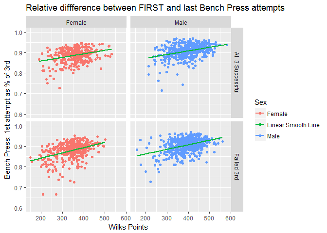<!-- -->

**Insights** 

- Similarly to squat findings. The stronger the lifter, the higher the first attempt is as compared to the third attempt (failed or successful). This applies to lifters of both sexes.

Is there a difference in how men and women pick their first attempts?


```r
g <- ggplot(Raw2014_2016[Raw2014_2016$BP_attempts %in% c('111','110') & Raw2014_2016$Total > 0,], 
            aes(Points, BP1_pct_of_3rd, colour = Sex_factor))
g + geom_smooth(method = "lm")+
    facet_grid(BP_attempts_factor~.) +
    labs(color = "Sex") +
    ggtitle("Relative diffference between FIRST and last BENCH attempts") + 
    xlab("Wilks Points") +
    ylab("Bench Press: 1st attempt as % of 3rd") +
    geom_hline(yintercept = 0.89, colour = "darkslategray", size = 1, linetype = 2)+
    geom_hline(yintercept = 0.87, colour = "blue", size = 1, linetype = 2) +
    annotate("text", x = 200, y = 0.905, label = "89% of the 3rd", colour = "darkslategray" ) +
    annotate("text", x = 200, y = 0.885, label = "87% of the 3rd", colour = "blue")
```

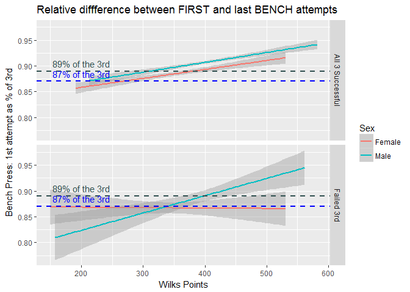<!-- -->

**Insights** 

- Among lifters that complete successfully all three attempts across all strength levels, women tend to pick lower percentage compared to men

- Women across all strength levels that fail their third attempts tend to pick similar openers compared to their third. Is it possible that this lift is their weak point compared to the other two lifts and hence, they use the same rules

- **Takeaway:** consider the opener in 89-90% range of the projected third attempt (based on female lifters with around 400 Wilks and successful third)

##### **Deadlift**

How big is first attempt compared to the third? 


```r
with(subset(Raw2014_2016,Deadlift_attempts %in% c('111','110') & Raw2014_2016$Total > 0),
summary(DL1_pct_of_3rd))
```

```
##    Min. 1st Qu.  Median    Mean 3rd Qu.    Max. 
##  0.0000  0.8769  0.8991  0.8779  0.9184  0.9800
```
What is the success rate of the third attempt after succeeding at 1st and 2nd?
Among women:

```r
with(subset(Raw2014_2016,Deadlift_attempts %in% c('111','110') & 
                Raw2014_2016$Total > 0 &
                Raw2014_2016$Sex == 'f'),
summary(DL3_success))
```

```
##    Min. 1st Qu.  Median    Mean 3rd Qu.    Max. 
##  0.0000  0.0000  1.0000  0.5977  1.0000  1.0000
```
Among men:

```r
with(subset(Raw2014_2016,Deadlift_attempts %in% c('111','110') & 
                Raw2014_2016$Total > 0 &
                Raw2014_2016$Sex == 'm'),
summary(DL3_success))
```

```
##    Min. 1st Qu.  Median    Mean 3rd Qu.    Max. 
##   0.000   0.000   1.000   0.507   1.000   1.000
```


```r
g <- ggplot(Raw2014_2016[Raw2014_2016$Deadlift_attempts %in% c('111','110') & Raw2014_2016$Total > 0,], 
            aes(Points, DL1_pct_of_3rd, colour = Sex_factor))
g + geom_point()+
    facet_grid(Deadlift_attempts_factor~Sex_factor) +
    labs(color = "Sex") +
    geom_smooth(method = "lm", show.legend = TRUE, aes(colour = "Linear Smooth Line"), se = FALSE) +
    ggtitle("Relative diffference between FIRST and last Deadlift attempts") +
    xlab("Wilks Points") +
    ylab("Deadlift: 1st attempt as % of 3rd") +
    scale_y_continuous(limits = c(0.6,1))
```

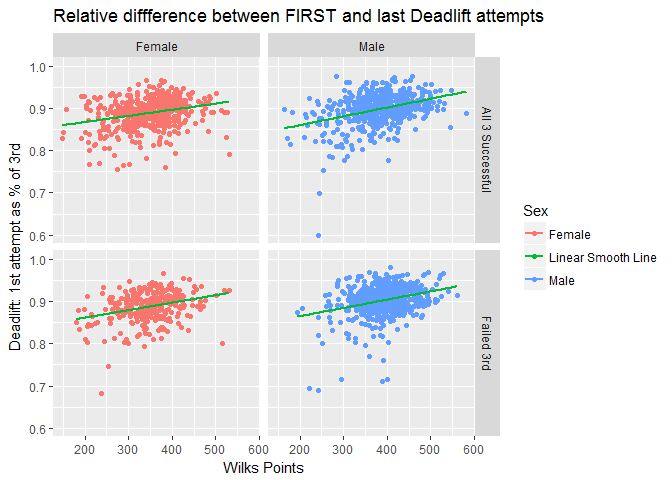<!-- -->

**Insights** 

- Similarly to squat/bench findings. The stronger the lifter, the higher the first attempt is as compared to the third attempt (failed or successful). This applies to lifters of both sexes.

- However, there seems to be more "low" outliers among men: thre are more male lifters with very low openers compared to their third attempts.

Is there a difference in how men and women pick their first attempts?


```r
g <- ggplot(Raw2014_2016[Raw2014_2016$Deadlift_attempts %in% c('111','110') & Raw2014_2016$Total > 0,], 
            aes(Points, DL1_pct_of_3rd, colour = Sex_factor))
g + geom_smooth(method = "lm")+
    facet_grid(Deadlift_attempts_factor~.) +
    labs(color = "Sex") +
    ggtitle("Relative diffference between FIRST and last Deadlift attempts") + 
    xlab("Wilks Points") +
    ylab("Deadlift: 1st attempt as % of 3rd") +
    geom_hline(yintercept = 0.90, colour = "darkslategray", size = 1, linetype = 2)+
    annotate("text", x = 200, y = 0.915, label = "90% of the 3rd", colour = "darkslategray" ) 
```

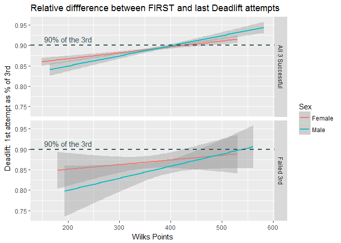<!-- -->

**Insights** 

- Among lifters that complete successfully all three attempts women with lower Wilks tend to pick relatively higher openers compared to men. But the relationship reverses for lifters with over 400 Wilks points. 

- Women across all strength levels that fail their third attempts tend to pick relatively higher first attempts compared to men. 

- These patterns might be explained by the hypothesis that as women get stronger, the importance of Deadlift in their Total diminishes. This will be evaluated in the future analysis.

- **Takeaway:** consider the opener in 89-90% range of the projected third attempt (based on female lifters with around 400 Wilks and successful third)

#### Absolute difference between attempts

*Subset:* 84kg Women (my weight class)

What is the average difference in kg between first and last attempts for the 84kg class?


```r
s1 <- aggregate(Squat1_kg_diff_3rd ~ Weightclass_Num + Sex + Points_group, data = Raw2014_2016, mean)
bp1 <- aggregate(BP1_kg_diff_3rd ~ Weightclass_Num + Sex + Points_group, data = Raw2014_2016, mean)
dl1 <- aggregate(DL1_kg_diff_3rd ~ Weightclass_Num + Sex + Points_group, data = Raw2014_2016, mean)

wclass_points <- expand.grid(unique(Raw2014_2016$Weightclass_Num),
                                unique(Raw2014_2016$Points_group))
colnames(wclass_points) <- c("Weightclass_Num", "Points_group")

wclass_points <-
    wclass_points %>%
    left_join(.,
              unique(Raw2014_2016[,c("Weightclass_Num", "Sex")]),
              by = "Weightclass_Num")

Kg_diff_summary <- 
    left_join(wclass_points, s1, by = c("Weightclass_Num", "Points_group", "Sex")) %>% 
    left_join(., bp1, by = c("Weightclass_Num", "Points_group", "Sex")) %>% 
    left_join(., dl1, by = c("Weightclass_Num", "Points_group", "Sex")) 
```


```r
g <- ggplot(Kg_diff_summary[Kg_diff_summary$Sex == 'f' & 
                            Kg_diff_summary$Weightclass_Num == 84 ,], 
            aes(Points_group))
g + geom_line(aes(y = Squat1_kg_diff_3rd, colour = "Squat"), size = 2) +
    geom_line(aes(y = BP1_kg_diff_3rd, colour = "Bench Press"), size = 2) +
    geom_line(aes(y = DL1_kg_diff_3rd, colour = "Deadlift"), size = 2) +
    scale_y_continuous(breaks = seq(0,20,2.5)) +
    labs(y = "Difference between First and Last in kg",
         x = "Wilks Points Groups",
         colour = "Lift") +
    scale_x_continuous(breaks = seq(0,500,25)) +
    ggtitle("Average jump between first and last attempts by Wilks points groups",
            subtitle = "84kg class Women")
```

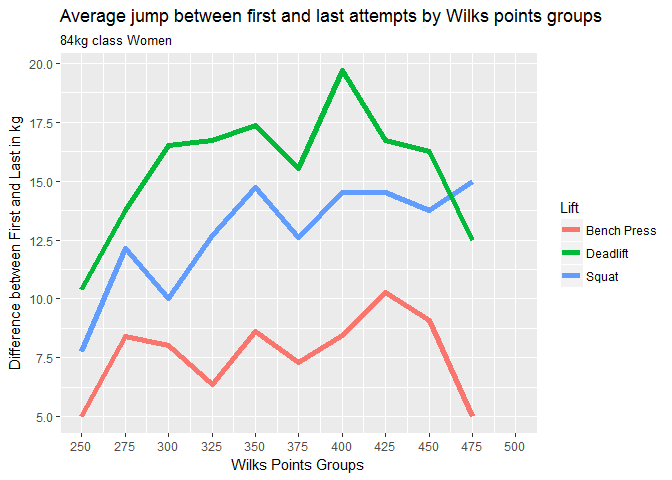<!-- -->
  
**Note:** The kg increase between attempts has to be a multiple of 2.5 unless the lifter goes after a national record (official rules)


What is the success rate of each jump for the 84kg class?

*Success rate* is calculated as % of lifters that completed all 3 attempts successfully

##### **Squat**


```r
Squat1 <- as.data.frame(table(Raw2014_2016$Squat1_kg_diff_3rd, 
                              Raw2014_2016$Sex, 
                              Raw2014_2016$Weightclass_Num),
                        row.names = NULL,
                        stringsAsFactors = FALSE)

colnames(Squat1) <- c('Squat1_kg_diff_3rd','Sex','Weightclass_Num','Count')

Squat1$Squat1_kg_diff_3rd <- as.numeric(Squat1$Squat1_kg_diff_3rd)
Squat1$Weightclass_Num <- as.numeric(Squat1$Weightclass_Num)

Squat1_diff <- expand.grid(unique(Raw2014_2016$Weightclass_Num),
                           unique(Raw2014_2016$Squat1_kg_diff_3rd))

colnames(Squat1_diff) <- c("Weightclass_Num", "Squat1_kg_diff_3rd")

Squat1_diff <-
    Squat1_diff %>%
    left_join(.,
              unique(Raw2014_2016[,c("Weightclass_Num", "Sex")]),
              by = "Weightclass_Num") %>%
    left_join(.,
              Squat1,
              by = c("Weightclass_Num", "Squat1_kg_diff_3rd", "Sex")) %>%
    left_join(.,
          aggregate(Squat_111 ~ Squat1_kg_diff_3rd + Sex + Weightclass_Num, data = Raw2014_2016, mean),
          by = c("Weightclass_Num", "Squat1_kg_diff_3rd", "Sex")) %>%
    left_join(.,
          aggregate(Points ~ Squat1_kg_diff_3rd + Sex + Weightclass_Num, data = Raw2014_2016, mean),
          by = c("Weightclass_Num", "Squat1_kg_diff_3rd", "Sex"))

Squat1_diff$Squat_111 <- Squat1_diff$Squat_111*100
```


```r
g <- ggplot(Squat1_diff[Squat1_diff$Sex == 'f' & Squat1_diff$Weightclass_Num == 84 & Squat1_diff$Count > 0,], aes(Squat1_kg_diff_3rd))
g + geom_bar(aes(y = Count, colour = "Number of Lifters"), fill = "darkgrey", stat='identity') +
    geom_point(aes(y = Squat_111/1.5, colour = "% of lifters with 3 good squats"), size = 4) +
    scale_y_continuous(breaks = seq(0,80,5), sec.axis = sec_axis(~.*1.5, name = "% of lifters with 3 good squats", breaks = seq(0,100,10))) +
    theme(legend.position = c(0.2, 0.9), 
          panel.grid = element_blank()) +
    labs(y = "Number of lifters",
         x = "Kg difference between FIRST and last SQUAT",
         colour = "Metric") +
    scale_colour_manual(values = c("salmon", "darkgrey")) +
    scale_x_continuous(breaks = seq(0,30,2.5)) +
    geom_text(aes(y = Squat_111/1.5, label=round(Squat_111)), size = 3, color = "lightsalmon4", vjust = -1) +  
    ggtitle("Success rate of Squats by the size of the jump between FIRST and last",
            subtitle = "84kg class Women")
```

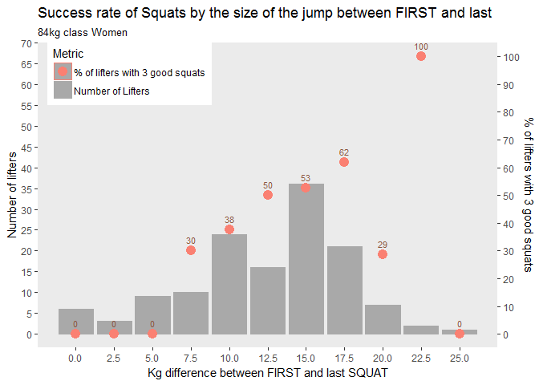<!-- -->


```r
g <- ggplot(Squat1_diff[Squat1_diff$Sex == 'f' & Squat1_diff$Weightclass_Num == 84 & Squat1_diff$Count > 0,], aes(Squat1_kg_diff_3rd))
g + geom_bar(aes(y = Count, colour = "Number of Lifters"), fill = "darkgrey", stat='identity') +
    geom_point(aes(y = Points/10, colour = "Average wilks"), size = 4) +
    scale_y_continuous(breaks = seq(0,50,5), sec.axis = sec_axis(~.*10, name = "Average Wilks", breaks = seq(0,600,50))) +
    theme(legend.position = c(0.1, 0.9), 
          panel.grid = element_blank()) +
    labs(y = "Number of lifters",
         x = "Kg difference between FIRST and last SQUAT",
         colour = "Metric") +
    scale_colour_manual(values = c("green4", "darkgrey")) +
    scale_x_continuous(breaks = seq(0,30,2.5)) +
    geom_text(aes(y = Points/10, label=round(Points)), size = 3, color = "lightsalmon4", vjust = -1) +  
    ggtitle("Average Wilks by the size of the jump between FIRST and last",
            subtitle = "84kg class Women")
```

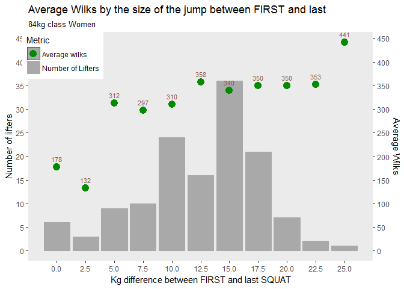<!-- -->

**Insights** 

- The most common difference between first and third attempts is 15kg. 

- The highest success rate is among lifters with 17.5kg jumps (except the outlier at 22.5kg).

- There is no significant difference among lifters with 12.5 to 22.5kg jumps

##### **Bench Press**

What is the success rate of each jump for the 84kg class?


```r
BP1 <- as.data.frame(table(Raw2014_2016$BP1_kg_diff_3rd, 
                              Raw2014_2016$Sex, 
                              Raw2014_2016$Weightclass_Num),
                        row.names = NULL,
                        stringsAsFactors = FALSE)
colnames(BP1) <- c('BP1_kg_diff_3rd','Sex','Weightclass_Num','Count')
BP1$BP1_kg_diff_3rd <- as.numeric(BP1$BP1_kg_diff_3rd)
BP1$Weightclass_Num <- as.numeric(BP1$Weightclass_Num)

BP1_diff <- expand.grid(unique(Raw2014_2016$Weightclass_Num), unique(Raw2014_2016$BP1_kg_diff_3rd))
colnames(BP1_diff) <- c("Weightclass_Num", "BP1_kg_diff_3rd")

BP1_diff <-
    BP1_diff %>%
    left_join(.,
              unique(Raw2014_2016[,c("Weightclass_Num", "Sex")]),
              by = "Weightclass_Num") %>%
    left_join(.,
              BP1,
              by = c("Weightclass_Num", "BP1_kg_diff_3rd", "Sex")) %>%
    left_join(.,
          aggregate(BP_111 ~ BP1_kg_diff_3rd + Sex + Weightclass_Num, data = Raw2014_2016, mean),
          by = c("Weightclass_Num", "BP1_kg_diff_3rd", "Sex")) %>%
    left_join(.,
          aggregate(Points ~ BP1_kg_diff_3rd + Sex + Weightclass_Num, data = Raw2014_2016, mean),
          by = c("Weightclass_Num", "BP1_kg_diff_3rd", "Sex"))

BP1_diff$BP_111 <- BP1_diff$BP_111*100
```


```r
g <- ggplot(BP1_diff[BP1_diff$Sex == 'f' & BP1_diff$Weightclass_Num == 84 & BP1_diff$Count > 0,], aes(BP1_kg_diff_3rd))
g + geom_bar(aes(y = Count, colour = "Number of Lifters"), fill = "darkgrey", stat='identity') +
    geom_point(aes(y = BP_111/1.25, colour = "% of lifters with 3 good BPs"), size = 4) +
    scale_y_continuous(breaks = seq(0,50,5), sec.axis = sec_axis(~.*1.25, name = "% of lifters with 3 good BPs", breaks = seq(0,100,10))) +
    theme(legend.position = c(0.85, 0.9), 
          panel.grid = element_blank()) +
    labs(y = "Number of lifters",
         x = "Kg difference between FIRST and last BENCH PRESS",
         colour = "Metric") +
    scale_colour_manual(values = c("salmon", "darkgrey")) +
    scale_x_continuous(breaks = seq(0,30,2.5)) +
    geom_text(aes(y = BP_111/1.25, label=round(BP_111)), size = 3, color = "lightsalmon4", vjust = -1) +  
    ggtitle("Success rate of Bench Press by the size of the jump between FIRST and last",
            subtitle = "84kg class Women")
```

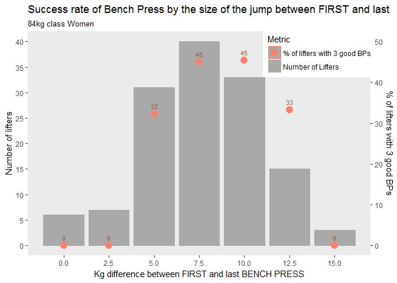<!-- -->

```r
g <- ggplot(BP1_diff[BP1_diff$Sex == 'f' & BP1_diff$Weightclass_Num == 84 & BP1_diff$Count > 0,], aes(BP1_kg_diff_3rd))
g + geom_bar(aes(y = Count, colour = "Number of Lifters"), fill = "darkgrey", stat='identity') +
    geom_point(aes(y = Points/10, colour = "Average Wilks"), size = 4) +
    scale_y_continuous(breaks = seq(0,50,5), sec.axis = sec_axis(~.*10, name = "Average Wilks", breaks = seq(0,600,50))) +
    theme(legend.position = c(0.1, 0.9), 
          panel.grid = element_blank()) +
    labs(y = "Number of lifters",
         x = "Kg difference between FIRST and last BENCH PRESS",
         colour = "Metric") +
    scale_colour_manual(values = c("green4", "darkgrey")) +
    scale_x_continuous(breaks = seq(0,30,2.5)) +
    geom_text(aes(y = Points/10, label=round(Points)), size = 3, color = "lightsalmon4", vjust = -1) +  
    ggtitle("Average Wilks by the size of the jump between FIRST and last",
            subtitle = "84kg class Women")
```

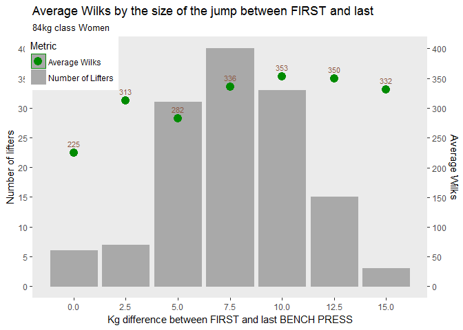<!-- -->

**Insights** 

- The most common difference between first and third attempts is 7.5kg. 

- Around 45% of lifters succeed in all three attempts with this difference, same as 10kg difference.

- Bench Press has the lowest success rate at any size of the jump compared to two other lifts

- Wilks for lifters with bigger jumps (10-12.5kg) is a bit higher. 

##### **Deadlift**


```r
Deadlift1 <- as.data.frame(table(Raw2014_2016$DL1_kg_diff_3rd, 
                              Raw2014_2016$Sex, 
                              Raw2014_2016$Weightclass_Num),
                        row.names = NULL,
                        stringsAsFactors = FALSE)
colnames(Deadlift1) <- c('DL1_kg_diff_3rd','Sex','Weightclass_Num','Count')
Deadlift1$DL1_kg_diff_3rd <- as.numeric(Deadlift1$DL1_kg_diff_3rd)
Deadlift1$Weightclass_Num <- as.numeric(Deadlift1$Weightclass_Num)

Deadlift1_diff <- expand.grid(unique(Raw2014_2016$Weightclass_Num), unique(Raw2014_2016$DL1_kg_diff_3rd))
colnames(Deadlift1_diff) <- c("Weightclass_Num", "DL1_kg_diff_3rd")

Deadlift1_diff <-
    Deadlift1_diff %>%
    left_join(.,
              unique(Raw2014_2016[,c("Weightclass_Num", "Sex")]),
              by = "Weightclass_Num") %>%
    left_join(.,
              Deadlift1,
              by = c("Weightclass_Num", "DL1_kg_diff_3rd", "Sex")) %>%
    left_join(.,
          aggregate(Deadlift_111 ~ DL1_kg_diff_3rd + Sex + Weightclass_Num, data = Raw2014_2016, mean),
          by = c("Weightclass_Num", "DL1_kg_diff_3rd", "Sex")) %>%
    left_join(.,
          aggregate(Points ~ DL1_kg_diff_3rd + Sex + Weightclass_Num, data = Raw2014_2016, mean),
          by = c("Weightclass_Num", "DL1_kg_diff_3rd", "Sex"))

Deadlift1_diff$Deadlift_111 <- Deadlift1_diff$Deadlift_111*100
```


```r
g <- ggplot(Deadlift1_diff[Deadlift1_diff$Sex == 'f' & Deadlift1_diff$Weightclass_Num == 84 & Deadlift1_diff$Count > 0,], aes(DL1_kg_diff_3rd))
g + geom_bar(aes(y = Count, colour = "Number of Lifters"), fill = "darkgrey", stat='identity') +
    geom_point(aes(y = Deadlift_111/2.5, colour = "% of lifters with 3 good deadlifts"), size = 4) +
    scale_y_continuous(breaks = seq(0,50,5), sec.axis = sec_axis(~.*2.5, name = "% of lifters with 3 good deadlifts", breaks = seq(0,100,10))) +
    theme(legend.position = c(0.2, 0.9), 
          panel.grid = element_blank()) +
    labs(y = "Number of lifters",
         x = "Kg difference between FIRST and last DEADLIFT",
         colour = "Metric") +
    scale_colour_manual(values = c("salmon", "darkgrey")) +
    scale_x_continuous(breaks = seq(0,30,2.5)) +
    geom_text(aes(y = Deadlift_111/2.5, label=round(Deadlift_111)), size = 3, color = "lightsalmon4", vjust = 1.75) +  
    ggtitle("Success rate of Deadlifts by the size of the jump between FIRST and last",
            subtitle = "84kg class Women")
```

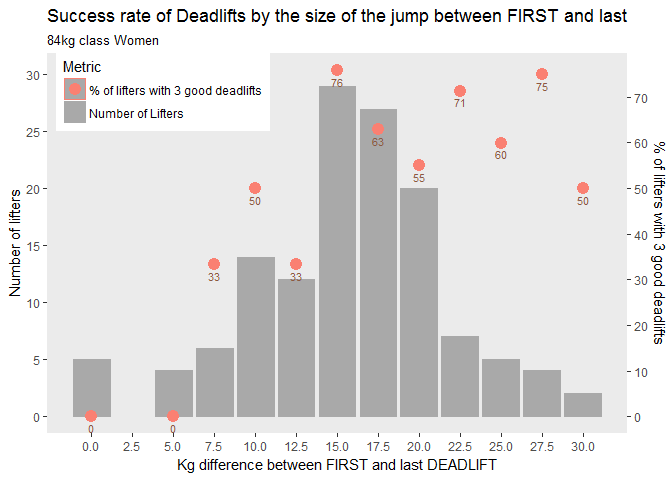<!-- -->

```r
g <- ggplot(Deadlift1_diff[Deadlift1_diff$Sex == 'f' & Deadlift1_diff$Weightclass_Num == 84 & Deadlift1_diff$Count > 0,], aes(DL1_kg_diff_3rd))
g + geom_bar(aes(y = Count, colour = "Number of Lifters"), fill = "darkgrey", stat='identity') +
    geom_point(aes(y = Points/10, colour = "Average Wilks"), size = 4) +
    scale_y_continuous(breaks = seq(0,50,5), sec.axis = sec_axis(~.*10, name = "Average Wilks", breaks = seq(0,600,50))) +
    theme(legend.position = c(0.1, 0.9), 
          panel.grid = element_blank()) +
    labs(y = "Number of lifters",
         x = "Kg difference between FIRST and last DEADLIFT",
         colour = "Metric") +
    scale_colour_manual(values = c("green4", "darkgrey")) +
    scale_x_continuous(breaks = seq(0,30,2.5)) +
    geom_text(aes(y = Points/10, label=round(Points)), size = 3, color = "lightsalmon4", vjust = 1.75) +  
    ggtitle("Average Wilks by the size of the jump between FIRST and last",
            subtitle = "84kg class Women")
```

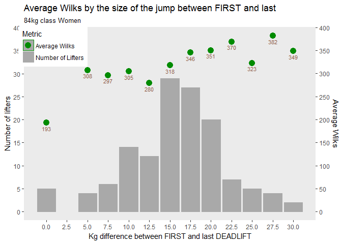<!-- -->

**Insights** 

- There is a lot more variance in the size of the jump between first and last deadlift attempts.

- The most common difference between first and third attempts is 15kg, with 20kg being close second. 

- The average success rate varies significantly, but is above 50% for the jumps above 15kg.

- Deadlift has the highest success rate across all jumps compared to two other lifts.

- Wilks score seem to incease as the size of the jumps increases. This is quite obvious given that deadlift is usually the biggest lift out of three.


